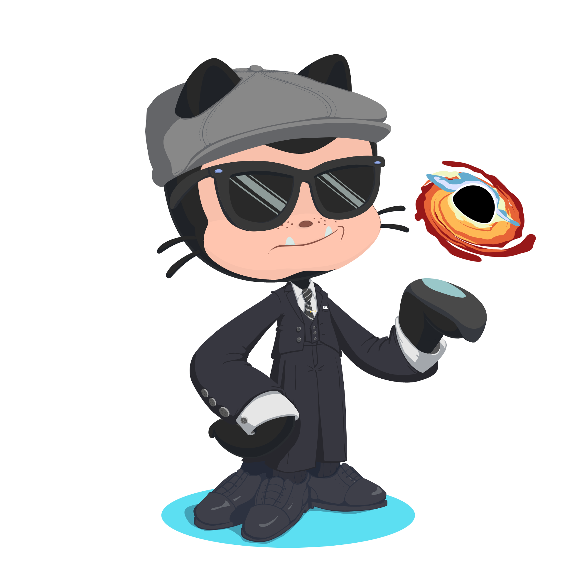

<h1 align="center">Hi  , I'm Ahmed Shaikh</h1>

 

 

  

  

- 🌱 I’m currently learning **Python Development**

- 📝 I regularly write articles on [loftydroid](https://dev.to/loftydroid)

- 📫 How to reach me **shaikhahmed243@gmail.com**

- ⚡ Fun fact, **I read manga**
 
<h3 align="left">Connect with me:</h3>

<h3 align="left">Languages and Tools:</h3>

      

